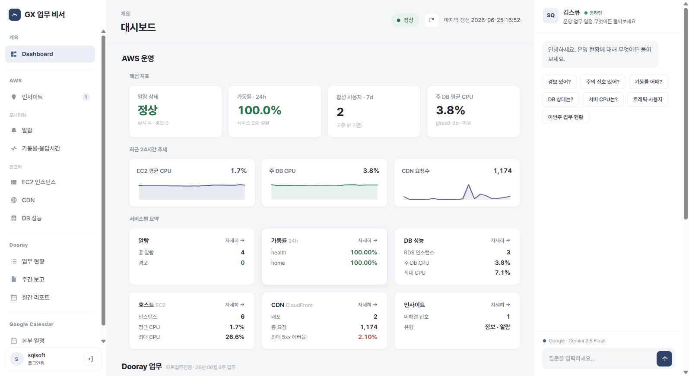

# gx-buddy — GX 운영 업무 비서

> AWS 운영 모니터링 · Dooray 업무 · 본부 일정을 **한 화면**에서 보고, **AI에게 물어보는** 사내 운영 비서.
> 이상 징후가 생기면 **Google Chat으로 먼저 알려줍니다.**

`gx-buddy`는 GX 사업부의 운영 상태(AWS)와 업무(Dooray)·일정(Google Calendar)을 하나의 대시보드에 모으고, Gemini 기반 채팅으로 *"지금 경보 있어?"* 같은 질문에 **수집된 데이터를 근거로** 답하는 운영 비서입니다. 화면 타이틀은 **GX 업무 비서**, 리포지토리 식별자는 `hermes_agent` 입니다.



---

## ✨ 한눈에

- 🟢 **무인 모니터링** — 백그라운드 수집기가 AWS·Dooray·캘린더를 주기적으로 모아 SQLite에 적재. 화면과 AI는 DB만 읽어 **항상 빠르게(3초 내)** 응답합니다.
- 🔔 **조용한 알림** — 이상 징후(위험/주의)가 **새로 뜰 때만** Google Chat으로 푸시하고, 해소되면 정상화 1회. 평소엔 조용합니다(노이즈·깜빡임 억제).
- 💬 **AI 비서** — Gemini가 수집된 운영 데이터를 근거로 한국어 답변(스트리밍). 추측이 아니라 실제 지표 기반입니다.
- 🔒 **로그인 보호** — 단일 공용 계정 JWT 로그인. 미인증 시 모든 기능·데이터가 차단됩니다.

## 🖥 화면 구성

| 영역 | 메뉴 | 내용 |
|------|------|------|
| **개요** | Dashboard | 핵심 KPI(가동률·CPU·DB·CDN·사용자) + 도메인별 요약 카드 |
| **AWS** | 인사이트 | 이상 징후 카드 + AI 종합 코멘트 (평상시 0건) |
| | 알람 · 가동률·응답시간 · EC2 · CDN · DB 성능 | CloudWatch 지표·알람·상태 |
| **Dooray** | 업무 현황 · 주간 보고 · 월간 리포트 | 파트 업무 진행, 주간보고 자동 생성, 지난달 월간 리포트 |
| **Google Calendar** | 본부 일정 | 근태(연차·반차·외근)·회의 일정(iCal) |

## 🧩 주요 기능

- **AWS 모니터링** — CloudWatch 알람, 엔드포인트 가동률/응답시간(p95), EC2 호스트(CPU·상태검사·크레딧), RDS(CPU·여유공간·연결수), CloudFront(5xx/4xx·요청수), 접근 로그 기반 트래픽/품질.
- **운영 인사이트** — 결정적 룰 엔진이 임계·추세·이상을 평가해 **위험/주의 신호만** 카드로 띄우고, Gemini가 우선순위·원인·조치를 한국어로 덧붙입니다. 저볼륨 노이즈는 절대 하한(floor)으로, 경계선 깜빡임은 히스테리시스로 억제합니다.
- **Google Chat 알림** — 신호가 새로 발생하거나 해소될 때만 웹훅으로 통지(스팸 방지). `GCHAT_WEBHOOK` 미설정 시 조용히 비활성.
- **Dooray 업무** — 이번 주 파트 업무 현황, 주간 보고 자동 생성, 지난달 월간 리포트.
- **AI 채팅** — *"경보 있어?", "DB 상태는?", "이번주 업무 현황"* 등 자연어 질문에 SSE 스트리밍으로 답변.
- **로그인** — 단일 공용 계정(아이디/비밀번호) JWT 로그인. 8시간 세션, IP 기반 무차별 대입 차단.

## ⚙️ 동작 방식

```
┌─────────────────────────────┐        주기 수집(AWS/Dooray/GCal)
│ 백그라운드 Scheduler 데몬   │ ───────────────────────────────┐
│ (60초 tick, --workers 1)    │                                 ▼
└─────────────────────────────┘                        ┌────────────────┐
                                                        │  SQLite (WAL)  │
   FastAPI  /api/*  ◀── DB만 읽음(3초 내) ──────────────│  스냅샷·시계열 │
      │                                                 └────────────────┘
      ├── 정적 프론트(SPA, StyleSeed)                            ▲
      ├── Gemini 채팅(SSE) ── 컨텍스트로 DB 사용 ────────────────┘
      └── insights 룰엔진 ──▶ alerting ──▶ Google Chat
```

핵심 원칙: **비싼 외부 호출(AWS·Gemini)은 백그라운드 수집 계층에서만** 일어납니다. API·프론트·채팅은 **SQLite만 읽어** 빠르고, AWS 비용도 절감합니다. 스케줄러가 단일이어야 하므로 **`uvicorn --workers 1`** 이 전제입니다.

## 🚀 빠른 시작

**준비물:** Docker Desktop, AWS 자격증명(읽기 전용 CloudWatch/Logs/EC2 권한).

```bash
# 1) 인증 자격증명 생성 (표준 라이브러리만 — 입력은 화면에 안 보임)
python -m dashboard.auth hash-password   # → AUTH_PASSWORD_HASH=... 출력
python -m dashboard.auth gen-secret      # → AUTH_SECRET=... 출력

# 2) .env 작성 (위 출력 줄을 그대로 붙여넣고 AUTH_USERNAME 추가)
#    AUTH_USERNAME=공용아이디
#    AUTH_PASSWORD_HASH=pbkdf2_sha256$...
#    AUTH_SECRET=...
#    (선택) GEMINI_API_KEY=... / DOORAY_TOKEN=... / GCHAT_WEBHOOK=... / GCAL_ICS_URL=...

# 3) 빌드 + 기동 (Docker)
run_dashboard.cmd            # 내부적으로 docker build + docker run -d
```

브라우저에서 **http://localhost:8090** 접속 → 로그인 → 대시보드.

> `run_dashboard.cmd`는 `--env-file .env`로 `.env`를 주입합니다. `AUTH_SECRET`이 없으면 서버가 기동을 거부합니다.

## 🔑 환경 변수

### 필수 — 로그인

| 변수 | 설명 |
|------|------|
| `AUTH_USERNAME` | 공용 계정 아이디 |
| `AUTH_PASSWORD_HASH` | 비밀번호의 PBKDF2 해시 (`python -m dashboard.auth hash-password`) |
| `AUTH_SECRET` | JWT 서명용 시크릿 (`python -m dashboard.auth gen-secret`) |

### 선택 — 연동(미설정 시 해당 기능만 비활성)

| 변수 | 기본값 | 설명 |
|------|--------|------|
| `GEMINI_API_KEY` / `GOOGLE_API_KEY` | — | AI 채팅·인사이트 코멘트(Gemini) |
| `GEMINI_MODEL` | `gemini-2.5-flash` | 사용할 Gemini 모델 |
| `DOORAY_TOKEN` | — | Dooray 개인 액세스 토큰(`id:secret`) |
| `DOORAY_PROJECT_ID` | (파트업무진행) | Dooray 프로젝트 ID |
| `GCHAT_WEBHOOK` | — | 이상 징후 알림용 Google Chat 웹훅 |
| `GCAL_ICS_URL` | — | 업무 일정 캘린더(iCal 비공개 주소) |
| `GCAL_ATTEND_ICS_URL` | — | 근태(연차·반차·외근) 캘린더 |
| `EC2_INSTANCE_ID` | (기본 인스턴스) | 호스트 메트릭 대상 EC2 |

### 선택 — 로그인 정책

| 변수 | 기본값 | 설명 |
|------|--------|------|
| `AUTH_TOKEN_TTL_HOURS` | `8` | 로그인 세션(JWT) 유효 시간 |
| `AUTH_MAX_ATTEMPTS` | `5` | 동일 IP 로그인 실패 허용 횟수 |
| `AUTH_LOCKOUT_MINUTES` | `10` | 실패 초과 시 차단 시간(분) |
| `AUTH_COOKIE_SECURE` | `false` | 인증 쿠키 `Secure` 속성. **운영(HTTPS) 시 `true` 필수** |
| `AUTH_TRUSTED_PROXY` | `false` | nginx/ALB 등 신뢰 프록시 뒤에서만 `true`. 레이트리밋 IP를 `X-Real-IP` 우선, 없으면 XFF의 rightmost로 식별 |

> 수집 주기·보관일수·DB 경로 등은 `dashboard/config.py`에서 관리합니다(알람·가동률 300초, DB·EC2·CDN·트래픽 600초, Dooray 1시간, 캘린더 30분, 시계열 30일 보관).

## 🔒 인증 설명

대시보드는 **단일 공용 계정**으로 보호됩니다. 미인증 접근은 모든 화면이 `/login`으로 이동하고 `/api/*`는 `401`을 반환합니다. 구현 특징:

- **JWT(HS256)·PBKDF2 해시를 파이썬 표준 라이브러리만으로 구현** — PyJWT·bcrypt 등 외부 인증 패키지 0.
- 토큰은 본문이 아니라 **httpOnly·SameSite=Strict 쿠키**로만 발급(XSS 토큰 탈취·CSRF 방어).
- 자격증명은 `.env`로만 주입(소스·응답에 평문 비노출). `AUTH_SECRET` 미설정 시 기동 거부.
- 비밀번호 교체: `python -m dashboard.auth hash-password` 재실행 → `.env`의 `AUTH_PASSWORD_HASH` 교체 → 재기동.

> **운영(HTTPS 종단) 배포 시 `.env`에 `AUTH_COOKIE_SECURE=true`를 반드시 추가하세요.**

## 📁 프로젝트 구조

```
dashboard/
  api.py          FastAPI 앱 — /api/* 데이터 API + 인증 게이트 + 정적 서빙
  auth.py         단일 공용 계정 로그인(JWT HS256·PBKDF2, 표준 라이브러리만)
  config.py       환경변수·상수(.env 흡수)
  storage.py      SQLite 적재/조회(WAL)
  scheduler.py    백그라운드 수집 데몬(60초 tick)
  insights.py     이상 징후 룰 엔진(임계·절대량 floor·히스테리시스)
  alerting.py     인사이트 → Google Chat 푸시(신규/해소만)
  chat.py         Gemini 채팅(SSE 스트리밍)
  aggregations.py / aws_clients.py   AWS 집계·클라이언트
  collectors/     alarms·uptime·traffic·db·ec2·cloudfront·dooray·gcal
  static/         index.html·login.html·dashboard.js·styles.css(StyleSeed)
Dockerfile.dashboard / run_dashboard.cmd   컨테이너 빌드·실행
docs/styleseed/   UI 디자인 표준(StyleSeed)
```

## 🛠 기술 스택

- **백엔드:** Python 3 · FastAPI · uvicorn (`--workers 1`)
- **AWS:** boto3 (CloudWatch · Logs Insights · EC2, read-only)
- **저장소:** SQLite (표준 라이브러리, WAL) — 스냅샷 + 시계열(30일 보관)
- **AI:** Gemini API (REST 직접 호출, SSE 스트리밍)
- **연동:** Dooray REST · Google Calendar iCal (표준 `urllib`)
- **프론트:** 바닐라 ES5 JS + Chart.js · StyleSeed 디자인(Pretendard 폰트)
- **인증:** 표준 라이브러리만(`hmac`/`hashlib`/PBKDF2) — 외부 인증 패키지 0
- **배포:** Docker

## 📝 운영 메모

- **포트:** 컨테이너 `8080` → 호스트 `8090` 매핑(`docker run -p 8090:8080`).
- **단일 워커 필수:** 멀티워커 시 스케줄러가 워커마다 떠 수집 중복·SQLite 락이 발생합니다.
- **비용 최적화:** Logs Insights는 기간별 차등 수집(1일 실시간 / 7일 1시간 / 30일 6시간).
- **Git Bash에서 `docker run` 시:** `MSYS_NO_PATHCONV=1`을 선행해 경로 변환(`/aws/config` 깨짐)을 막습니다.
- **서버(EC2) 이관 시:** `/aws` 마운트·`AWS_*` env를 제거하면 인스턴스 IAM 역할(boto3 자격증명 체인)을 자동 사용합니다.

---

UI는 **StyleSeed 디자인 시스템**을 따릅니다(`docs/styleseed/` 참고). 상세 동작·환경변수는 `dashboard/config.py`, `Dockerfile.dashboard`, `run_dashboard.cmd`를 확인하세요.
